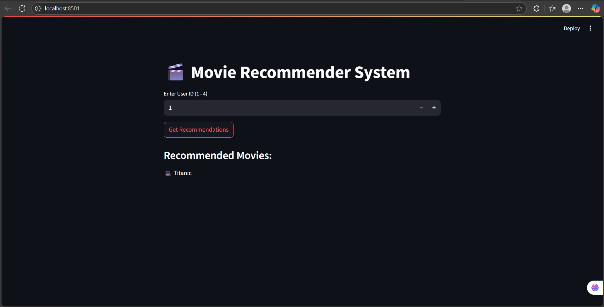

# 🎬 WhatToWatch - Movie Recommendation System

A content-based movie recommendation system built with Python. This project recommends movies based on textual similarity using Natural Language Processing (NLP) techniques.

## 🚀 Features

- 🔍 Recommend similar movies based on a selected title
- 🧠 Utilizes content-based filtering
- 💻 Beginner-friendly code with a clean interface (Jupyter Notebook)
- 📊 Uses NLP techniques for analyzing textual data

## 📂 Dataset

- Includes movie titles, overviews, keywords, genres, and cast
- Preprocessed to extract meaningful content for similarity analysis

## 🧠 Tech Stack

- **Python**
- **Pandas**
- **Scikit-learn**
- **NLP** – *TF-IDF*, *CountVectorizer*
- **Cosine Similarity**

## ⚙️ How It Works

1. 🧹 Data cleaning and preprocessing  
2. 🔡 Vectorization of textual features  
3. 📐 Calculation of similarity scores using cosine similarity  
4. 🎯 Retrieval of top-N similar movies based on input

## 📦 Installation

Clone the repository and install the dependencies:

```bash
git clone https://github.com/ShridhiGupta/WhatToWatch.git
cd WhatToWatch
pip install -r requirements.txt
```

## 🧪 Run the Notebook

Launch Jupyter Notebook and execute the cells:

```bash
jupyter notebook
```

Choose your input movie title to get recommendations.

## 🌟 Future Improvements

- 🤝 Add collaborative filtering
- 🌐 Build a web interface using **Streamlit** or **Flask**
- 🎞️ Integrate **TMDB API** for posters, ratings, and trailers

## 📸 Project Preview

Here’s a quick look at the movie recommendation output:




## 📄 License

This project is licensed under the [MIT License](LICENSE).

---

### 🙌 Contributions

Feel free to **contribute**, **suggest improvements**, or ⭐ star the repository!

